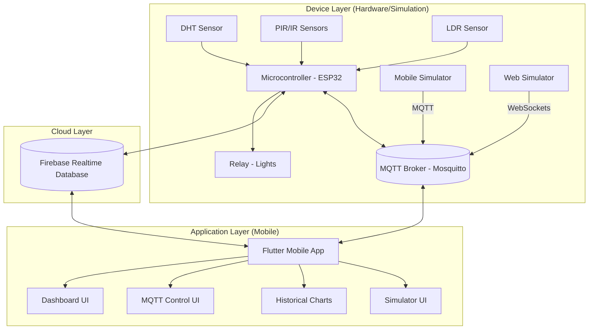

# 🏫 Smart Classroom IOT: Project Report

## 1. Project Overview

### Problem Statement
Traditional classroom management relies on manual monitoring of environmental factors and energy usage. Lights are often left on when not needed, and environmental conditions (temperature/humidity) are not tracked, which can impact student comfort and focus. There is no centralized system to monitor attendance or control classroom facilities remotely.

### Objectives
- To develop a real-time monitoring system for classroom environmental conditions.
- To implement dual-protocol connectivity (Firebase & MQTT/Mosquitto) for robust device control.
- To implement an automated/remote control system for classroom lighting to save energy.
- To provide a live count of students present in the classroom.
- To visualize historical data trends for better facility management.
- To provide a modern navigation experience using Zoom Drawer.

### Scope
- **Real-time Monitoring**: Temperature, Humidity, and Student Count.
- **Trend Visualization**: Historical charts for Temperature, Humidity, and Student Attendance.
- **Remote Control**: Manual toggle for lights via a mobile application.
- **Data Logging**: Storing sensor data in the cloud for trend analysis.
- **User Interface**: A premium mobile dashboard for easy access and control.

### Proposed Solution
A comprehensive IoT ecosystem consisting of:
1.  **Hardware Layer**: Sensors and actuators connected to a microcontroller (e.g., ESP32/ESP8266).
2.  **Cloud Layer**: Firebase Realtime Database and Mosquitto MQTT Broker for data synchronization.
3.  **Simulation Layer**: Mobile and Web-based IoT simulators for robust offline testing.
4.  **Application Layer**: A Flutter mobile app featuring a Zoom Drawer navigation system and dedicated Firebase/MQTT control screens.

---

## 2. System Inputs and Outputs

| Input/Output | Type | Meaning |
| :--- | :--- | :--- |
| **Temperature** | Input | Measures the ambient heat in the classroom (Celsius). |
| **Humidity** | Input | Measures the moisture level in the air (Percentage). |
| **Student Count** | Input | Tracks the number of individuals entering/exiting the room. |
| **Light Level** | Input | Monitors the brightness to determine if artificial lighting is needed. |
| **Light Status** | Output | Controls the ON/OFF state of the classroom lights. |
| **System Mode** | Input/Output | Switches between AUTOMATIC and MANUAL operation. |

---

## 3. Device Layer: Sensors and Actuators

| Device | Category | Function |
| :--- | :--- | :--- |
| **DHT11 / DHT22** | Sensor | Detects temperature and humidity levels. |
| **PIR / IR Sensors** | Sensor | Detects motion/entry to count students. |
| **LDR (Photoresistor)** | Sensor | Measures ambient light intensity. |
| **Relay Module** | Actuator | Acts as an electronic switch to toggle high-voltage lights. |
| **Mobile Simulator** | Virtual Device | Simulates sensor inputs directly from the mobile UI. |
| **Web Simulator** | Virtual Device | External browser-based tool for MQTT data injection. |

---

## 4. System Architecture & Block Diagram

### System Architecture
The system follows a three-tier architecture:
1.  **Device Layer (IoT)**: Collects data and performs physical actions.
2.  **Communication Layer (Firebase & MQTT)**: Acts as the "Brain" and data bridge for multi-protocol synchronization.
3.  **User Layer (Mobile App)**: Provides the control and visualization interface via BLoC state management.

### Block Diagram

---

## 5. Firmware Implementation (ESP8266)

The hardware logic is implemented in C++ using the Arduino framework. Key components of the firmware include:
- **Bi-directional Counting**: Uses two IR sensors (IR_A and IR_B) to detect entry and exit events based on the sequence of sensor triggers.
- **Dual Cloud Sync**: Periodically pushes sensor data (Temperature, Humidity, Light Status) to both **Firebase RTDB** and **Mosquitto MQTT Broker**.
- **Remote Commands**: Listens to MQTT topics for `mode` and `light` commands to override local logic.
- **Auto/Manual Logic**: In AUTO mode, lights are controlled by occupancy (students > 0). In MANUAL mode, they follow the app's command.

---

## 6. Test Strategy

### Overview
The test strategy focuses on verifying the integrity of data transmission, the responsiveness of controls, and the accuracy of visualizations.

### Test Cases

| ID | Test Case | Expected Result |
| :--- | :--- | :--- |
| **TC-01** | Sensor Data Accuracy | Sensor readings in the app match actual environmental conditions. |
| **TC-02** | Real-time Sync | Data updates on the dashboard within <1 second of change. |
| **TC-03** | Remote Control | Toggling light in app triggers physical relay immediately. |
| **TC-04** | Offline Resilience | App displays last cached data if connection is lost. |
| **TC-05** | History Recording | Data is correctly appended to the 'history' node in Firebase. |
| **TC-06** | Chart Rendering | Line charts correctly visualize fluctuations for all metrics (Temp, Humidity, Students). |
