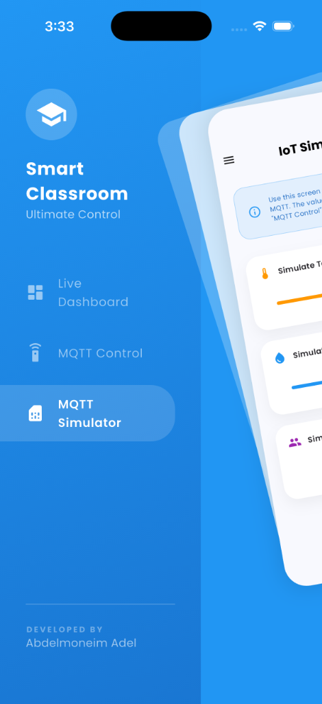
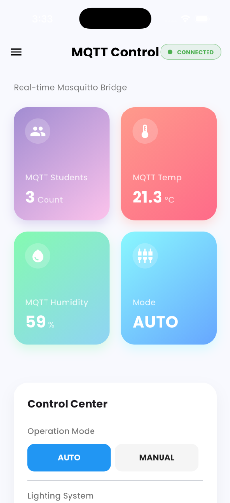
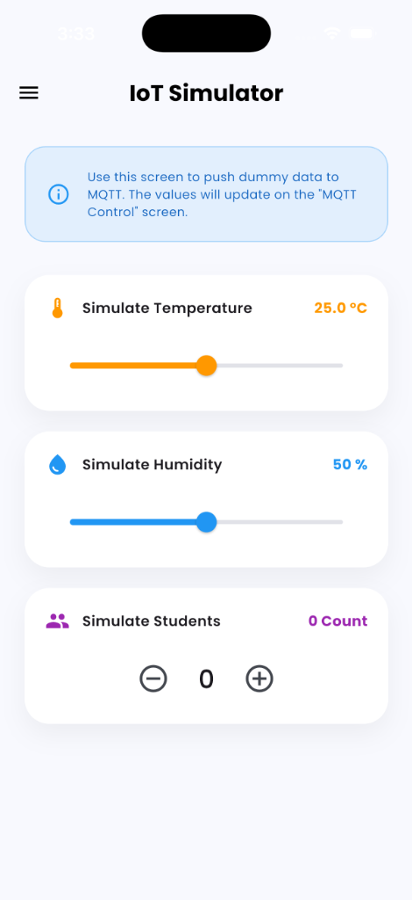
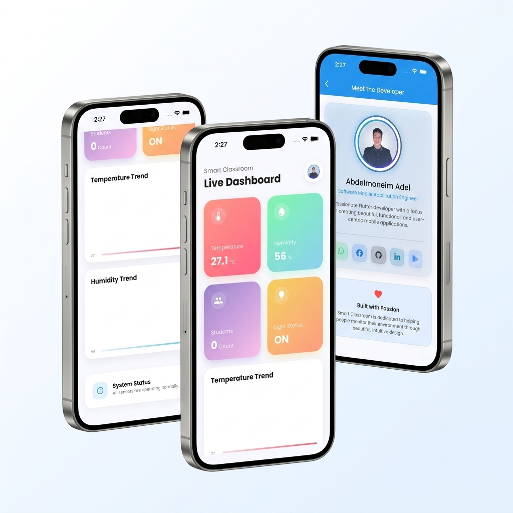
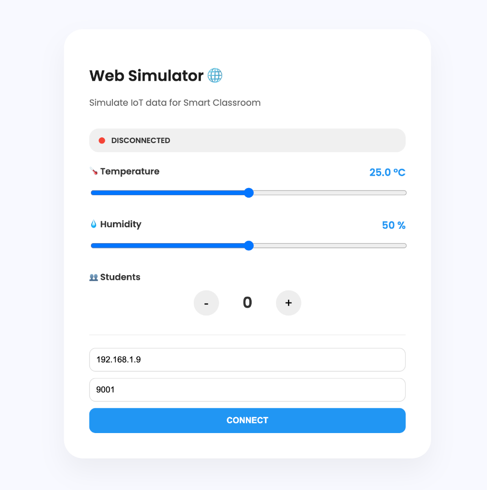
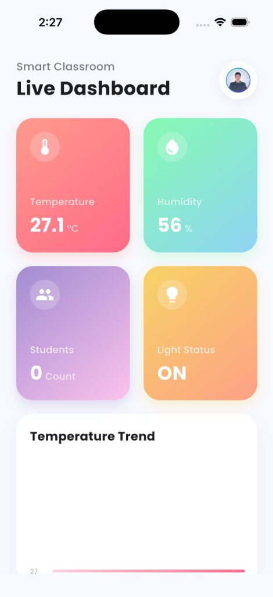
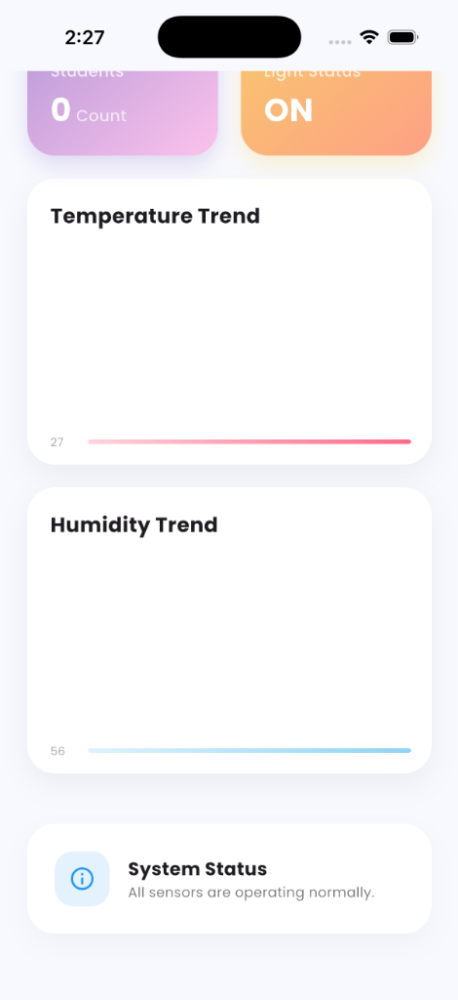
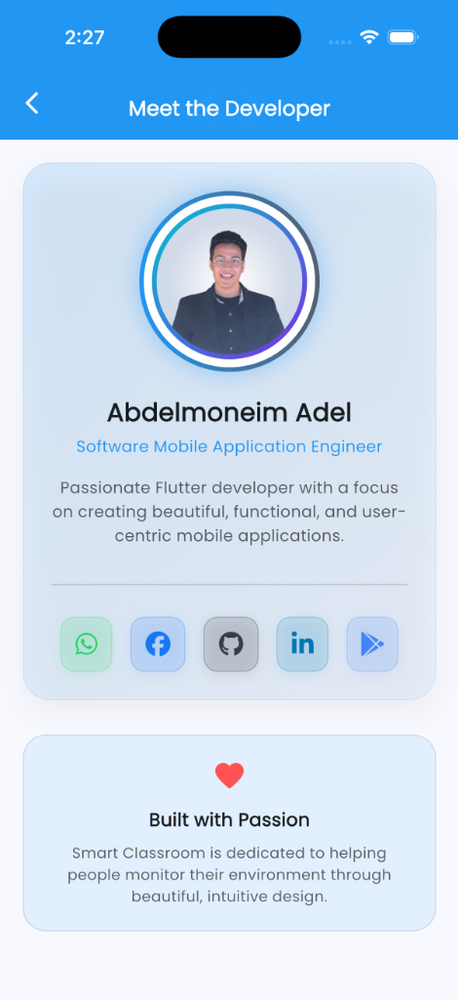

# 🏫 Smart Classroom IOT

[](https://flutter.dev)
[](https://mosquitto.org)

## 📱 App Showcase

<p align="center">
  
  
  
</p>

<p align="center">
  <i>Modern UI with Zoom Drawer, Real-time MQTT Control, and Integrated Simulator</i>
</p>

---


A cutting-edge IoT solution for modern classrooms. Monitor environmental conditions, track student presence, and control hardware in real-time with a premium, high-performance mobile dashboard.




---

## 📄 Project Report
A comprehensive report detailing the requirements, architecture, and testing strategy for this project is available.

👉 **[View Project Report](Project_Report.md)**

---

## ✨ Key Features

### 📊 Multi-Protocol Dashboard
- **Dual Connectivity**: Seamlessly switches between **Firebase Real-time** and **MQTT (Mosquitto)**.
- **Live Environmental Tracking**: Instant updates on Temperature, Humidity, and Student Analytics.
- **Bi-directional Control**: Send commands and receive status updates for Mode (Auto/Manual) and Lighting.

### 🎨 Premium UI/UX
- **Zoom Drawer Navigation**: A modern side-menu experience for fluid navigation.
- **Interactive Analytics**: High-performance line charts (fl_chart) for historical trends.
- **Glassmorphism Design**: High-end visuals with gradients, smooth shadows, and micro-animations.

### 🛠 Integrated Testing Tools
- **Mobile IoT Simulator**: Built-in screen to simulate sensor data locally from within the app.
- **Professional Web Simulator**: A dedicated web dashboard for laptop-to-app testing via WebSockets.

<p align="center">
  
</p>

---

## 🛠 Tech Stack
- **Frontend**: Flutter (Dart)
- **State Management**: BLoC / Cubit
- **Cloud Backend**: Firebase Real-time Database
- **IoT Protocol**: MQTT (Mosquitto Broker)
- **Visuals**: FL Chart & Google Fonts

---

## 🚀 Getting Started

### Prerequisites
- Flutter SDK installed on your machine.
- A Firebase project set up.

### Installation

1. **Clone the repository**
   ```bash
   git clone https://github.com/AbdelmenamAdel/Smart-Classroom-IOT.git
   ```

2. **Install dependencies**
   ```bash
   flutter pub get
   ```

3. **Configure Firebase**
   - Run `flutterfire configure` to set up your project.
   - Ensure you have a `classroom` node in your Realtime Database.

4. **Run the app**
   ```bash
   flutter run
   ```

---

## 📸 Screenshots

| Dashboard | History & Trends | Meet Developer |
| :---: | :---: | :---: |
|  |  |  |

---

## 👨‍💻 About the Developer

**Abdelmoneim Adel**
*Software Mobile Application Engineer*

Passionate about building high-quality, user-centric mobile applications using Flutter.

[](https://www.linkedin.com/in/abdelmoneim-adel)
[](https://github.com/AbdelmenamAdel/)
[](https://www.facebook.com/abdelmenam.adel.10)

---

## 📝 License
This project is licensed under the MIT License - see the [LICENSE](LICENSE) file for details.
